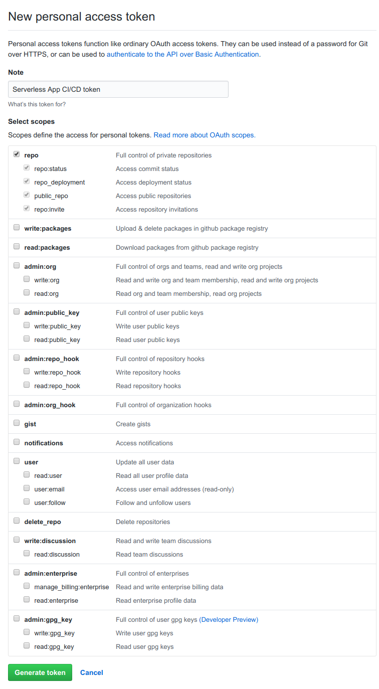
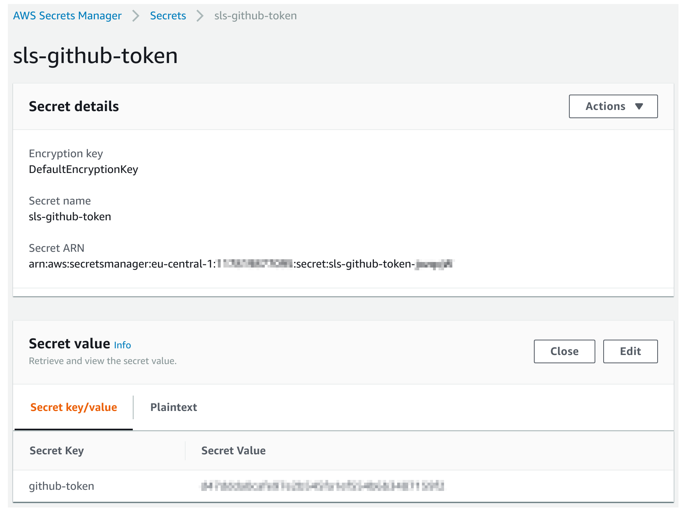

### Preconditions
* AWS CLI is locally installed with default credentials for an AWS account
* Node / NPM
* Maven

### Startup and first deployment Steps: 

**1. Fork and clone locally**

**2. install dependencies:** `npm install` 

**3. Produce A Github Token** 

Go to: https://github.com/settings/tokens
 and create an access Token (see permissions below)

_This access token will be used by AWS CodePipeline to poll for changes and grab our
application code._

**4. Add the Github Token as a secret in AWS Secret Manager**

In order to allow CI/CD using AWS CodePipeline we store the GitHub Token we produced in step 3
in AWS Secret manager. It is omportant to use the same AWS region you plan to deploy your application to.

Add the Token as a secret with:
Secret Name: `sls-github-token` 
Secret Key: `github-token`

example:

**5. Configure serverless.yml**

* Under service set your application name
* Under provider.region set your target AWS region
* Under custom.github-repo set forked GitHub's repo details (Owner,Repo)

**6. Build the Backend and Frontend**

`mvn -f backend clean install` 
`npm run build --prefix frontend`

**7. Deploy the application** 

`sls deploy --stage staging`

This will deploy to application including the CI/CD pipeline, two stages (staging,prod) including backend and frontend.

* The first deployment is slow as we have to wait for a full Cloudformation distribution propagation. further deployment will be fast.
* As CloudFormation provisions our stack it will create the pipeline which will then deploy the `prod` stage.

**Done!**